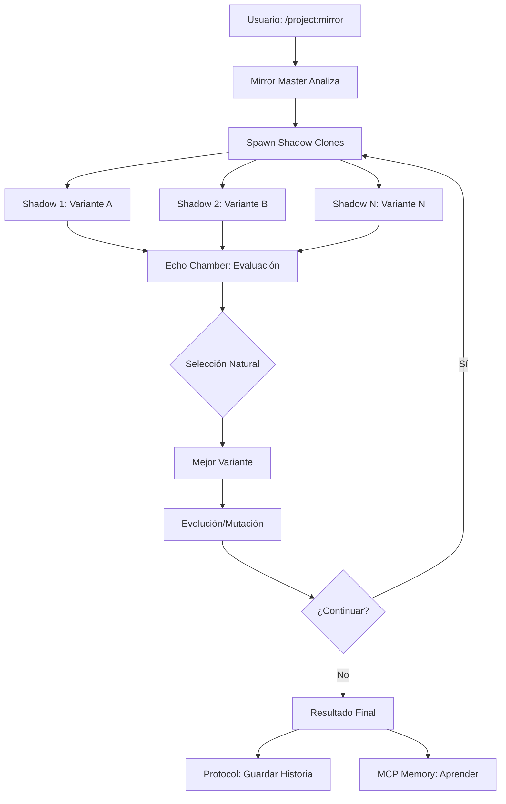

# 🦇 INFORME DE INTEGRACIÓN: INFINITE LOOP + AUTOMATOR

## 🎭 Propuestas de Nombres (Tema Batman)

### **1. MIRROR SYSTEM** (Sistema de Espejos) ✨ [RECOMENDADO]
- **Justificación**: Como los espejos de la Batcueva que reflejan múltiples versiones de Batman
- **Submódulos**:
  - **Mirror Master**: Orquestador principal (como Alfred supervisando)
  - **Shadow Clones**: Agentes paralelos (como las sombras de Batman)
  - **Echo Chamber**: Sistema de retroalimentación y aprendizaje

### **2. SHADOW MULTIPLIER** (Multiplicador de Sombras)
- Evoca las múltiples sombras que Batman proyecta para intimidar
- Los agentes son como sombras trabajando en paralelo

### **3. GOTHAM PARALLEL** (Paralelo de Gotham)
- Múltiples realidades de Gotham ejecutándose simultáneamente
- Cada agente es una versión alternativa resolviendo el mismo problema

### **4. BATCAVE REPLICATOR** (Replicador de la Batcueva)
- Como si se crearan múltiples Batcuevas, cada una con su propio Batman

### **5. MULTIVERSE ENGINE** (Motor Multiverso)
- Inspirado en los múltiples universos de Batman en DC Comics
- Cada iteración es un universo alternativo

## 🔄 Análisis de Integración: Infinite Loop → Automator

### 📊 Comparación de Capacidades

| Característica | Infinite Loop | Automator | Sinergia Potencial |
|---------------|--------------|-----------|-------------------|
| **Ejecución Paralela** | ✅ Sub-agentes masivos | ✅ Claude Squad | 🚀 Ultra-paralelización |
| **Iteración Evolutiva** | ✅ Generación progresiva | ❌ No nativo | 🎯 Nueva capacidad |
| **Gestión de Contexto** | ✅ Optimización por oleadas | ⚠️ Básica | 💡 Mejora significativa |
| **Persistencia** | ❌ Solo archivos | ✅ Protocol + MCP | 🔥 Historia evolutiva |
| **Automatización** | ✅ Comando único | ✅ ALFRED loop | ⚡ Super-automatización |

## 🚀 Propuestas de Integración

### 1. **MIRROR MODULE (Módulo 10)** - Nueva Adición a Automator

```bash
~/glados/setups/automator/10-mirror/
├── README.md
├── install.sh
├── mirror-engine/
│   ├── orchestrator.py      # Mirror Master
│   ├── shadow-clone.py      # Plantilla de agente
│   └── echo-chamber.py      # Sistema de aprendizaje
├── specs/
│   ├── code-evolution.md    # Evolución de código
│   ├── test-generation.md   # Generación de tests
│   └── refactor-patterns.md # Patrones de refactorización
└── commands/
    └── mirror.md           # Comando /project:mirror
```

### 2. **Casos de Uso Revolucionarios**

#### A. **Evolución de Código Automática**
```bash
/project:mirror evolve src/ 20 "optimize for performance"
```
- 20 agentes analizan el código simultáneamente
- Cada uno propone optimizaciones diferentes
- El mejor resultado se selecciona y evoluciona

#### B. **Generación Masiva de Tests**
```bash
/project:mirror test-gen src/ infinite "achieve 100% coverage"
```
- Agentes generan tests hasta alcanzar cobertura total
- Cada agente se especializa en diferentes edge cases
- Aprendizaje continuo de fallos anteriores

#### C. **Refactorización Inteligente**
```bash
/project:mirror refactor legacy/ 10 "modernize to ES6+"
```
- Múltiples estrategias de refactorización en paralelo
- Validación automática con tests existentes
- Evolución gradual del código

#### D. **Documentación Dinámica**
```bash
/project:mirror document src/ 5 "technical + user docs"
```
- Diferentes estilos de documentación simultáneos
- Generación de ejemplos y tutoriales
- Actualización automática con cambios de código

### 3. **Integración con Módulos Existentes**

#### **Con ALFRED (09)**: Super Loop Evolutivo
```yaml
# alfred.yaml con Mirror
mirror_mode:
  enabled: true
  parallel_attempts: 5
  evolution_strategy: "best_of_breed"
```
- ALFRED lanza múltiples mirrors para cada tarea
- Selecciona la mejor solución de cada generación
- Aprende de todos los intentos vía MCP Memory

#### **Con Protocol (06)**: Historia Multidimensional
```markdown
## historialDeProyecto.md
### Mirror Evolution Log
- Generation 1: [5 variants] → Selected: Performance optimization
- Generation 2: [5 variants] → Selected: Memory efficiency
- Generation 3: [5 variants] → Selected: Hybrid approach
```

#### **Con Claude Squad (01)**: Híper-Paralelización
- Claude Squad maneja la infraestructura
- Mirror System orquesta la estrategia
- Escala hasta 100+ agentes simultáneos

#### **Con Taskmaster (08)**: Descomposición Fractal
```javascript
// Task → Subtasks → Mirror variants
{
  task: "Implement OAuth2",
  mirror_strategy: {
    variants: ["JWT", "Session", "Hybrid"],
    parallel_implementations: 3,
    selection_criteria: "security + performance"
  }
}
```

### 4. **Nuevas Capacidades Únicas**

#### **A. Competencia Evolutiva**
- Los agentes "compiten" con diferentes soluciones
- Selección natural de código
- Mutación y crossover de implementaciones

#### **B. A/B Testing Automático**
```bash
/project:mirror ab-test features/ 10 "user engagement"
```
- Genera 10 variantes de UI/UX
- Despliega automáticamente para testing
- Analiza métricas y evoluciona

#### **C. Exploración de Arquitecturas**
```bash
/project:mirror architect app/ 5 "microservices vs monolith"
```
- Implementa la misma app con diferentes arquitecturas
- Compara rendimiento, mantenibilidad, costos
- Documenta trade-offs

#### **D. Optimización de Prompts**
```bash
/project:mirror optimize-prompts ai-app/ infinite
```
- Evoluciona prompts para mejor rendimiento
- Prueba variaciones en paralelo
- Aprende patrones exitosos

### 5. **Arquitectura Técnica Propuesta**

```python
# Mirror Master (Orquestador Principal)
class MirrorMaster:
    def __init__(self):
        self.shadow_pool = ShadowClonePool()
        self.echo_chamber = EchoChamber()  # MCP Memory
        self.evolution_engine = EvolutionEngine()
    
    def orchestrate(self, spec, count, strategy):
        # Fase 1: Análisis
        context = self.analyze_current_state()
        
        # Fase 2: Generación Paralela
        shadows = self.shadow_pool.spawn(count)
        results = parallel_execute(shadows, spec, context)
        
        # Fase 3: Selección y Evolución
        best = self.evolution_engine.select(results)
        self.echo_chamber.learn(results, best)
        
        # Fase 4: Siguiente Generación
        if strategy == "infinite":
            return self.orchestrate(evolved_spec, count, strategy)
```

### 6. **Flujo de Trabajo Mirror-Enhanced**



### 7. **Comandos Propuestos**

```bash
# Básico
/project:mirror <tipo> <directorio> <cantidad>

# Avanzado
/project:mirror evolve src/ infinite --strategy="performance" --memory="learn"

# Tipos disponibles:
- evolve: Evolución de código existente
- generate: Generación desde especificaciones  
- test: Creación masiva de tests
- refactor: Refactorización inteligente
- optimize: Optimización de rendimiento
- document: Documentación dinámica
- architect: Exploración de arquitecturas
```

### 8. **Beneficios de la Integración**

1. **Velocidad 10x**: Paralelización masiva de tareas complejas
2. **Calidad Superior**: Selección natural de las mejores soluciones
3. **Aprendizaje Continuo**: Cada iteración mejora el sistema
4. **Exploración Creativa**: Descubre soluciones no obvias
5. **Reducción de Sesgos**: Múltiples perspectivas simultáneas
6. **Documentación Automática**: Historia completa de evolución

### 9. **Casos de Uso Específicos para Glados**

#### **Para Batman (Automatización Nocturna)**
```bash
/project:mirror optimize batman/ 10 "reduce execution time"
```
- 10 variantes de optimización ejecutándose
- Selecciona la más eficiente para tareas nocturnas

#### **Para DiskDominator**
```bash
/project:mirror ui-evolve components/ 20 "user engagement"
```
- 20 variantes de UI para análisis de discos
- A/B testing automático de interfaces

#### **Para MCP Servers**
```bash
/project:mirror mcp-optimize servers/ infinite "latency reduction"
```
- Evolución continua de servidores MCP
- Optimización automática de rendimiento

### 10. **Roadmap de Implementación**

#### **Fase 1: Prototipo** (1 semana)
- [ ] Adaptar infinite.md para Automator
- [ ] Crear mirror-engine básico
- [ ] Integrar con Claude Squad

#### **Fase 2: Integración** (2 semanas)
- [ ] Conectar con ALFRED
- [ ] Implementar Echo Chamber con MCP Memory
- [ ] Crear comandos slash personalizados

#### **Fase 3: Evolución** (1 mes)
- [ ] Estrategias de evolución avanzadas
- [ ] Dashboard de visualización
- [ ] Métricas de rendimiento

#### **Fase 4: Producción** (2 meses)
- [ ] Optimización para 100+ agentes
- [ ] Casos de uso específicos
- [ ] Documentación completa

## 🎯 Conclusión

La integración de Infinite Loop en Automator como **MIRROR SYSTEM** representa una evolución natural y poderosa. Transforma Automator de un sistema de automatización lineal a un **motor de evolución paralela** que puede:

1. **Explorar** múltiples soluciones simultáneamente
2. **Evolucionar** código mediante selección natural
3. **Aprender** de cada iteración vía MCP Memory
4. **Escalar** a cientos de agentes paralelos
5. **Optimizar** automáticamente cualquier aspecto del código

El nombre **MIRROR SYSTEM** captura perfectamente la esencia: como los espejos de la Batcueva, cada reflejo (agente) muestra una perspectiva diferente del mismo problema, y juntos revelan la solución óptima.

### 🦇 "En la oscuridad de la Batcueva, mil espejos reflejan mil soluciones"

---

**Próximos Pasos Recomendados:**
1. Crear directorio `~/glados/setups/automator/10-mirror/`
2. Adaptar el comando infinite.md
3. Implementar prototipo con 3-5 agentes
4. Probar con caso simple (ej: optimizar una función)
5. Iterar basándose en resultados