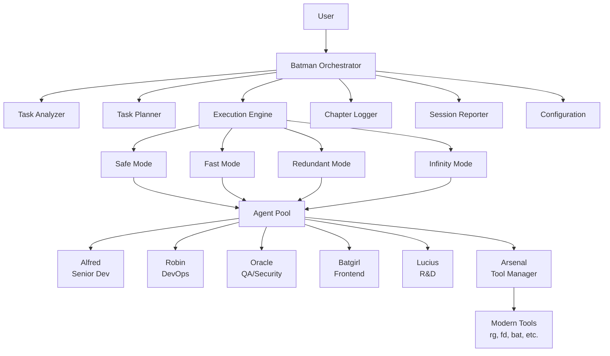
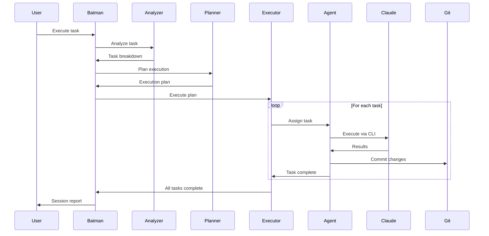
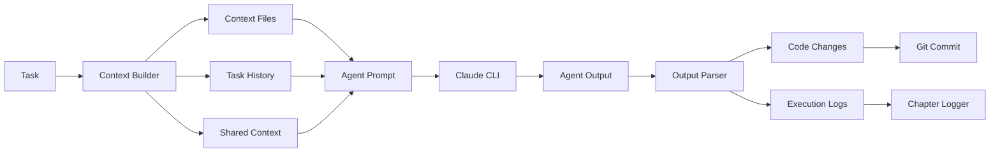

# Batman Incorporated Architecture

## Table of Contents

1. [Overview](#overview)
2. [System Architecture](#system-architecture)
3. [Component Details](#component-details)
4. [Data Flow](#data-flow)
5. [Design Patterns](#design-patterns)
6. [Security Architecture](#security-architecture)
7. [Scalability & Performance](#scalability--performance)
8. [Future Architecture](#future-architecture)

## Overview

Batman Incorporated is a sophisticated AI-orchestrated development system that coordinates multiple specialized Claude agents to accomplish complex software engineering tasks. The architecture emphasizes modularity, scalability, and clear separation of concerns.

### Core Principles

1. **Single Entry Point**: All interactions go through Batman
2. **Specialized Agents**: Each agent has distinct expertise
3. **Flexible Execution**: Multiple modes for different scenarios
4. **Tool Abstraction**: Arsenal provides unified tool interface
5. **Narrative Logging**: Human-readable progress tracking

## System Architecture

### High-Level Architecture



### Component Hierarchy

```
batman-incorporated/
├── batman.py                 # Main entry point
├── src/
│   ├── core/                # Core system components
│   │   ├── batman.py       # Main orchestrator
│   │   ├── task.py         # Task management
│   │   ├── config.py       # Configuration system
│   │   └── arsenal.py      # Tool management
│   ├── agents/             # Agent implementations
│   │   ├── base.py         # Abstract base agent
│   │   ├── alfred.py       # Senior developer
│   │   ├── robin.py        # DevOps specialist
│   │   ├── oracle.py       # QA/Security expert
│   │   ├── batgirl.py      # Frontend specialist
│   │   └── lucius.py       # R&D innovator
│   ├── execution/          # Execution strategies
│   │   ├── base.py         # Abstract execution mode
│   │   ├── safe_mode.py    # Isolated execution
│   │   ├── fast_mode.py    # Direct execution
│   │   ├── redundant_mode.py # Multi-agent validation
│   │   └── infinity_mode.py  # Parallel execution
│   ├── features/           # Additional features
│   │   ├── chapter_logger.py  # Narrative logging
│   │   └── session_reporter.py # Report generation
│   └── integrations/       # External integrations
│       ├── github_integration.py # GitHub operations
│       └── mcp_integration.py    # Shared context
```

## Component Details

### Core Components

#### BatmanIncorporated (Orchestrator)

The main orchestrator coordinates all operations:

```python
class BatmanIncorporated:
    def __init__(self, config: Config):
        self.config = config
        self.logger = ChapterLogger()
        self.arsenal = Arsenal()
        self.agents = self._initialize_agents()
    
    def execute_task(self, description: str, mode: str = "safe"):
        # 1. Analyze task
        tasks = self._analyze_and_plan(description)
        
        # 2. Determine execution mode
        if not mode:
            mode = self._determine_execution_mode(tasks)
        
        # 3. Execute via selected mode
        executor = self._get_executor(mode)
        results = executor.execute(tasks, self.agents)
        
        # 4. Generate report
        return self._generate_session_report(results)
```

**Responsibilities:**
- Task analysis and planning
- Agent coordination
- Mode selection
- Session management
- Report generation

#### Task System

Unified task representation with rich metadata:

```python
@dataclass
class Task:
    id: str
    title: str
    description: str
    type: TaskType
    priority: TaskPriority
    status: TaskStatus
    assigned_to: Optional[str]
    dependencies: List[str]
    context_files: List[str]
    
    def is_ready(self) -> bool:
        """Check if all dependencies are completed"""
        
    def start(self):
        """Mark task as in progress"""
        
    def complete(self, result: str):
        """Mark task as completed with result"""
```

**Features:**
- Dependency management
- Status tracking
- Priority handling
- Context management

#### Configuration System

Hierarchical YAML-based configuration:

```python
class Config:
    def __init__(self, config_file: str = None):
        self.config = self._load_config(config_file)
        self._expand_variables()
    
    def get(self, key: str, default=None):
        """Get config value with dot notation"""
        # config.get("agents.alfred.enabled")
        
    def set(self, key: str, value):
        """Set config value dynamically"""
```

**Features:**
- Dot notation access
- Variable expansion (`${VAR}`)
- Default values
- Runtime updates

#### Arsenal (Tool Management)

Intelligent tool abstraction layer:

```python
class Arsenal:
    def __init__(self):
        self.tools = self._detect_available_tools()
    
    def get_tool(self, operation: str) -> str:
        """Get best tool for operation"""
        # Returns "rg" for search if available, else "grep"
        
    def search_text(self, pattern: str, path: str):
        """Unified search interface"""
        tool = self.get_tool("search")
        if tool == "rg":
            return self._ripgrep_search(pattern, path)
        else:
            return self._grep_search(pattern, path)
```

**Supported Operations:**
- `search`: Text searching (rg/grep)
- `find`: File finding (fd/find)
- `view`: File viewing (bat/cat)
- `diff`: File comparison (delta/diff)
- `process`: Process viewing (procs/ps)

### Agent Architecture

#### BaseAgent

Abstract base class for all agents:

```python
class BaseAgent(ABC):
    def __init__(self, name: str, logger: ChapterLogger):
        self.name = name
        self.logger = logger
        self.specialties = []
        self.stats = AgentStats()
    
    @abstractmethod
    def should_handle_task(self, description: str) -> bool:
        """Determine if agent should handle task"""
    
    def execute_task(self, task: Task, **kwargs) -> bool:
        """Execute task via Claude CLI"""
        context = self._prepare_context(task, **kwargs)
        command = self._build_command(task, context)
        
        result = subprocess.run(command, capture_output=True)
        self._process_result(result)
        
        return result.returncode == 0
```

#### Specialized Agents

Each agent has unique capabilities:

**Alfred (Senior Developer)**
- Specialties: APIs, backend, architecture, databases
- Strengths: System design, complex logic, optimization
- Model: claude-3-opus (for complex tasks)

**Robin (DevOps/Junior)**
- Specialties: Automation, CI/CD, infrastructure, scripts
- Strengths: Deployment, tooling, monitoring
- Model: claude-3-sonnet (balanced)

**Oracle (QA/Security)**
- Specialties: Testing, security, validation, quality
- Strengths: Edge cases, vulnerabilities, coverage
- Model: claude-3-opus (for thoroughness)

**Batgirl (Frontend)**
- Specialties: UI/UX, components, accessibility, styling
- Strengths: User experience, responsiveness, design
- Model: claude-3-sonnet (creative)

**Lucius (R&D/Innovation)**
- Specialties: Research, optimization, documentation
- Strengths: New technologies, performance, best practices
- Model: claude-3-sonnet (analytical)

### Execution Modes

#### Safe Mode

Creates isolated Git worktrees for conflict-free parallel execution:

```python
class SafeMode(ExecutionMode):
    def execute(self, tasks, agents, real_agents=False):
        # 1. Create worktrees for each agent
        worktrees = self._create_worktrees(agents)
        
        # 2. Execute tasks in isolation
        results = []
        for task in tasks:
            agent = self._select_agent(task, agents)
            worktree = worktrees[agent.name]
            
            with self._in_worktree(worktree):
                result = agent.execute_task(task)
                results.append(result)
        
        # 3. Merge results back
        self._merge_worktrees(worktrees)
        
        # 4. Cleanup
        self._cleanup_worktrees(worktrees)
        
        return results
```

**Benefits:**
- No merge conflicts
- Parallel execution
- Safe rollback
- Clean integration

#### Fast Mode

Direct execution on main branch:

```python
class FastMode(ExecutionMode):
    def execute(self, tasks, agents, real_agents=False):
        # Direct execution, no isolation
        results = []
        for task in tasks:
            agent = self._select_agent(task, agents)
            result = agent.execute_task(task)
            results.append(result)
        return results
```

**Use Cases:**
- Quick fixes
- Single-file changes
- Time-critical updates

#### Redundant Mode

Multiple agents work on same task:

```python
class RedundantMode(ExecutionMode):
    def execute(self, tasks, agents, real_agents=False):
        results = []
        for task in tasks:
            # Multiple agents work on same task
            agent_results = []
            for agent in self._get_capable_agents(task, agents):
                result = agent.execute_task(task)
                agent_results.append(result)
            
            # Select best result
            best = self._select_best_result(agent_results)
            results.append(best)
        
        return results
```

**Strategies:**
- Voting: Majority agreement
- Best: Quality metrics
- Merge: Combine strengths

#### Infinity Mode

Maximum parallelization with queue-based distribution:

```python
class InfinityMode(ExecutionMode):
    def execute(self, tasks, agents, real_agents=False):
        # 1. Create task queue
        queue = self._create_task_queue(tasks)
        
        # 2. Launch parallel terminals
        self._launch_agent_terminals(agents)
        
        # 3. Agents pull from queue
        # (Manual coordination required)
        
        # 4. Monitor progress
        self._monitor_progress(queue)
```

**Requirements:**
- Multiple terminals
- Manual setup
- Queue management

## Data Flow

### Task Execution Flow



### Context Flow



## Design Patterns

### 1. Strategy Pattern

Execution modes implement strategy pattern:

```python
class ExecutionMode(ABC):
    @abstractmethod
    def execute(self, tasks, agents, **kwargs):
        pass

# Different strategies
safe_mode = SafeMode()
fast_mode = FastMode()
redundant_mode = RedundantMode()
```

### 2. Factory Pattern

Agent creation uses factory pattern:

```python
def create_agent(agent_type: str, logger: ChapterLogger) -> BaseAgent:
    agents = {
        "alfred": AlfredAgent,
        "robin": RobinAgent,
        "oracle": OracleAgent,
        "batgirl": BatgirlAgent,
        "lucius": LuciusAgent
    }
    return agents[agent_type](logger)
```

### 3. Observer Pattern

Event system for progress tracking:

```python
class EventEmitter:
    def __init__(self):
        self.listeners = defaultdict(list)
    
    def on(self, event: str, callback):
        self.listeners[event].append(callback)
    
    def emit(self, event: str, *args, **kwargs):
        for callback in self.listeners[event]:
            callback(*args, **kwargs)

# Usage
emitter.on("task.complete", lambda task: logger.log(f"✅ {task.title}"))
```

### 4. Chain of Responsibility

Task assignment follows chain pattern:

```python
class AgentChain:
    def __init__(self, agents: List[BaseAgent]):
        self.agents = agents
    
    def assign_task(self, task: Task) -> Optional[BaseAgent]:
        for agent in self.agents:
            if agent.should_handle_task(task.description):
                return agent
        return None
```

## Security Architecture

### Access Control

1. **File System Isolation**
   - Worktrees for agent isolation
   - Read-only context files
   - Controlled output directories

2. **Tool Execution**
   - Whitelisted commands only
   - Parameter sanitization
   - Output validation

3. **Configuration Security**
   - No sensitive data in configs
   - Environment variable isolation
   - Secure credential storage

### Agent Constraints

```python
class SecurityConstraints:
    MAX_FILE_SIZE = 10 * 1024 * 1024  # 10MB
    ALLOWED_EXTENSIONS = ['.py', '.js', '.ts', '.jsx', '.tsx', ...]
    FORBIDDEN_PATHS = ['/etc', '/sys', '/proc', ...]
    
    def validate_file_access(self, path: str) -> bool:
        """Ensure file access is allowed"""
        
    def sanitize_command(self, command: str) -> str:
        """Remove dangerous command patterns"""
```

## Scalability & Performance

### Optimization Strategies

1. **Tool Selection**
   - Modern tools (rg, fd) for 10-100x speedup
   - Fallback to standard tools
   - Automatic tool detection

2. **Parallel Execution**
   - Git worktrees for isolation
   - Queue-based task distribution
   - Agent pooling

3. **Caching**
   - MCP for shared context
   - Tool availability cache
   - Configuration cache

### Performance Metrics

```python
class PerformanceMonitor:
    def __init__(self):
        self.metrics = {
            'task_execution_time': [],
            'agent_utilization': {},
            'tool_performance': {},
            'memory_usage': []
        }
    
    def record_task_time(self, task_id: str, duration: float):
        """Track task execution time"""
    
    def get_bottlenecks(self) -> List[str]:
        """Identify performance bottlenecks"""
```

### Resource Management

```yaml
# Resource limits configuration
execution:
  max_parallel_agents: 5
  max_memory_per_agent: "2GB"
  task_timeout_minutes: 30
  
  resource_limits:
    cpu_percent: 80
    memory_percent: 70
    disk_io_limit: "100MB/s"
```

## Future Architecture

### Planned Enhancements

#### 1. Plugin System

```python
class Plugin(ABC):
    @abstractmethod
    def on_task_start(self, task: Task): pass
    
    @abstractmethod
    def on_task_complete(self, task: Task, result: Any): pass
    
    @abstractmethod
    def on_session_end(self, report: SessionReport): pass

# Example plugins
class SecurityScanner(Plugin):
    def on_task_complete(self, task, result):
        self.scan_for_vulnerabilities(result.changed_files)

class PerformanceAnalyzer(Plugin):
    def on_task_complete(self, task, result):
        self.analyze_performance_impact(result)
```

#### 2. Distributed Execution

```python
class DistributedExecutor:
    def __init__(self, nodes: List[ExecutionNode]):
        self.nodes = nodes
        self.scheduler = TaskScheduler()
    
    def execute(self, tasks: List[Task]):
        # Distribute tasks across nodes
        for task in tasks:
            node = self.scheduler.select_node(task)
            node.execute_remote(task)
```

#### 3. Advanced Agent Collaboration

```python
class CollaborationProtocol:
    def propose_solution(self, agent: BaseAgent, solution: Solution):
        """Agent proposes solution"""
    
    def review_proposal(self, reviewer: BaseAgent, proposal: Proposal):
        """Another agent reviews"""
    
    def reach_consensus(self, proposals: List[Proposal]) -> Solution:
        """Agents reach consensus"""
```

#### 4. Learning System

```python
class LearningSystem:
    def __init__(self):
        self.knowledge_base = KnowledgeBase()
        self.pattern_matcher = PatternMatcher()
    
    def learn_from_session(self, session: Session):
        """Extract patterns from successful sessions"""
        patterns = self.pattern_matcher.extract(session)
        self.knowledge_base.store(patterns)
    
    def suggest_approach(self, task: Task) -> Approach:
        """Suggest approach based on past experience"""
        similar = self.knowledge_base.find_similar(task)
        return self.generate_approach(similar)
```

### Architecture Evolution

1. **Microservices Architecture**
   - Agent as a Service (AaaS)
   - Task queue service
   - Result aggregation service

2. **Event-Driven Architecture**
   - Event bus for communication
   - Async task processing
   - Real-time updates

3. **Cloud-Native Design**
   - Container-based agents
   - Kubernetes orchestration
   - Auto-scaling capabilities

---

For implementation details, see [API.md](API.md).
For usage examples, see [EXAMPLES.md](EXAMPLES.md).