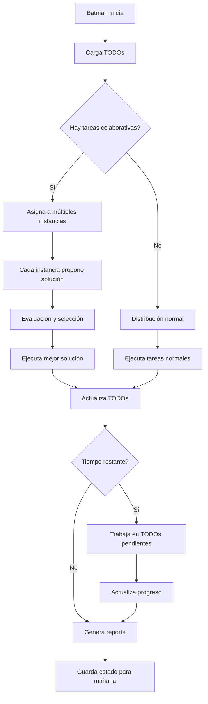

# Batman - Sistema Colaborativo de Instancias

## Concepto: Múltiples Soluciones y Optimización

### 1. Programación Competitiva/Colaborativa

Cuando varias instancias trabajan en el mismo problema, Batman puede:

```yaml
# batman/tasks/optimization-problem.txt
TASK: optimize_disk_cleanup
TYPE: collaborative
INSTANCES: 3  # 3 instancias trabajarán en esto

# Cada instancia propone una solución diferente
APPROACH_1: aggressive  # Instancia 1: Limpieza agresiva
APPROACH_2: conservative  # Instancia 2: Solo archivos muy antiguos
APPROACH_3: smart  # Instancia 3: Basado en patterns de uso

# Batman evalúa y elige la mejor
EVALUATION_CRITERIA:
  - safety_score
  - space_recovered
  - execution_time
  - risk_level
```

### 2. Sistema de Propuestas

```python
# batman/src/collaborative_system.py

class CollaborativeTask:
    def __init__(self, task_name, num_instances=3):
        self.task_name = task_name
        self.proposals = []
        self.num_instances = num_instances
        
    def add_proposal(self, instance_id, solution):
        """Cada instancia propone su solución"""
        proposal = {
            'instance_id': instance_id,
            'solution': solution,
            'code': solution['code'],
            'estimated_impact': solution['impact'],
            'risk_assessment': solution['risk'],
            'rationale': solution['rationale']
        }
        self.proposals.append(proposal)
        
    def evaluate_proposals(self):
        """Evalúa todas las propuestas y elige la mejor"""
        scores = []
        for proposal in self.proposals:
            score = self.calculate_score(proposal)
            scores.append((score, proposal))
            
        # Ordenar por score
        scores.sort(reverse=True, key=lambda x: x[0])
        
        # Log de la decisión
        logger.info(f"Propuestas evaluadas para {self.task_name}:")
        for score, prop in scores:
            logger.info(f"  {prop['instance_id']}: {score:.2f} - {prop['rationale']}")
            
        return scores[0][1]  # Retorna la mejor propuesta
        
    def calculate_score(self, proposal):
        """Calcula score basado en criterios"""
        safety = proposal['risk_assessment']['safety_score']
        effectiveness = proposal['estimated_impact']['effectiveness']
        efficiency = proposal['estimated_impact']['time_efficiency']
        
        # Ponderación: Seguridad > Efectividad > Eficiencia
        return (safety * 0.5) + (effectiveness * 0.3) + (efficiency * 0.2)
```

## 3. Sistema TODO Inteligente

### Estructura de TODOs Pendientes

```python
# batman/src/todo_system.py

class BatmanTODO:
    def __init__(self):
        self.todos_file = "batman_todos.json"
        self.categories = {
            'planned': [],      # Planificado pero no implementado
            'partial': [],      # Implementación parcial
            'needs_review': [], # Necesita revisión humana
            'blocked': [],      # Bloqueado por dependencias
            'ideas': []         # Ideas para el futuro
        }
        
    def add_todo(self, category, item):
        """Agrega un TODO con contexto"""
        todo = {
            'id': self.generate_id(),
            'timestamp': datetime.now().isoformat(),
            'category': category,
            'title': item['title'],
            'description': item['description'],
            'instance_id': item.get('instance_id'),
            'priority': item.get('priority', 'medium'),
            'estimated_time': item.get('estimated_time'),
            'dependencies': item.get('dependencies', []),
            'proposed_solution': item.get('proposed_solution'),
            'blockers': item.get('blockers', [])
        }
        self.categories[category].append(todo)
        self.save()
        
    def generate_nightly_plan(self):
        """Genera plan para la próxima noche basado en TODOs"""
        plan = {
            'high_priority': [],
            'medium_priority': [],
            'experimental': []
        }
        
        # Priorizar tareas planificadas
        for todo in self.categories['planned']:
            if todo['priority'] == 'high':
                plan['high_priority'].append(todo)
            else:
                plan['medium_priority'].append(todo)
                
        # Agregar ideas si hay tiempo
        for idea in self.categories['ideas'][:3]:  # Max 3 ideas
            plan['experimental'].append(idea)
            
        return plan
```

### Formato de TODOs en Tareas

```yaml
# batman/tasks/todos.yaml

todos:
  - title: "Implementar limpieza inteligente de logs"
    category: planned
    priority: high
    description: |
      Analizar patterns en logs antes de borrar.
      Mantener logs de errores críticos más tiempo.
    estimated_time: 2h
    proposed_solution: |
      1. Escanear logs con regex para clasificar
      2. Aplicar reglas diferentes según tipo
      3. Comprimir en lugar de borrar si es importante
      
  - title: "Sistema de backup incremental"
    category: partial
    priority: medium
    description: "Solo hacer backup de cambios desde último backup"
    instance_progress:
      instance_1: "Implementó detección de cambios"
      instance_2: "Creó estructura de metadatos"
      instance_3: "Pendiente: integración con rsync"
    blockers:
      - "Necesita más espacio en disco"
      
  - title: "ML para predecir uso de disco"
    category: ideas
    priority: low
    description: "Usar históricos para predecir cuándo se llenará el disco"
    dependencies:
      - "Sistema de métricas histónicas"
      - "Biblioteca ML ligera"
```

## 4. Flujo de Trabajo Nocturno



## 5. Ejemplo de Colaboración Real

### Noche 1: Problema de Optimización de Backups

```log
[00:00] Batman: Iniciando tarea colaborativa "optimize_backup_strategy"
[00:05] Instance_1: Propone backup completo semanal + incrementales diarios
[00:10] Instance_2: Propone deduplicación + compresión aggressive
[00:15] Instance_3: Propone backup selectivo basado en cambios recientes
[00:20] Batman: Evaluando propuestas...
[00:21] Batman: Seleccionada propuesta Instance_3 (score: 8.7/10)
[00:22] Batman: Ejecutando backup selectivo...
[01:30] Batman: Backup completado. Ahorro: 60% espacio, 40% tiempo
[01:31] Batman: Agregando a TODOs: "Mejorar algoritmo de selección"
```

### Reporte Matutino

```markdown
# Batman Report - 2024-06-05

## Tareas Completadas
- ✓ Backup optimizado (60% menos espacio)
- ✓ Limpieza de logs (2.3GB liberados)
- ✓ Índices actualizados

## Decisiones Colaborativas
- **Backup Strategy**: Elegida opción 3 de 3
  - Razón: Mejor balance seguridad/eficiencia
  - Alternativas guardadas para análisis

## TODOs Actualizados
### Nuevos
- [ ] Mejorar algoritmo de selección de archivos
- [ ] Implementar cache de patrones de uso

### En Progreso
- [~] Sistema de compresión adaptativa (70% completo)

### Ideas para Explorar
- [ ] ML para predecir archivos importantes
- [ ] Backup distribuido en múltiples drives

## Métricas
- Tiempo total: 6.5 horas
- Tareas completadas: 12/15
- Propuestas evaluadas: 7
- TODOs generados: 4
```

## 6. Comandos para Gestión de TODOs

```bash
# Ver TODOs pendientes
batman todos list

# Agregar nuevo TODO
batman todos add "Implementar monitoreo de temperatura de discos"

# Priorizar TODO
batman todos prioritize TODO-123 high

# Ver progreso de tarea colaborativa
batman collab status optimize_backup_strategy

# Generar plan para próxima noche
batman plan tomorrow
```

## Beneficios del Sistema

1. **Mejora Continua**: Cada noche Batman es más inteligente
2. **Decisiones Informadas**: Múltiples perspectivas antes de actuar
3. **Memoria Institucional**: TODOs capturan aprendizajes
4. **Flexibilidad**: Si hay tiempo, explora ideas nuevas
5. **Transparencia**: Registro de por qué se tomó cada decisión