# 📚 Batman Enhanced - Documentación Completa

## 📖 Tabla de Contenidos

1. [Introducción](#introducción)
2. [Arquitectura del Sistema](#arquitectura-del-sistema)
3. [Instalación Detallada](#instalación-detallada)
4. [Configuración](#configuración)
5. [Uso del Sistema](#uso-del-sistema)
6. [Interfaz Web](#interfaz-web)
7. [Gestión de Tareas](#gestión-de-tareas)
8. [Integraciones](#integraciones)
9. [Análisis y Optimizaciones](#análisis-y-optimizaciones)
10. [Reportes](#reportes)
11. [Solución de Problemas](#solución-de-problemas)
12. [API Reference](#api-reference)
13. [Desarrollo](#desarrollo)
14. [FAQ](#faq)

---

## 🌟 Introducción

Batman Enhanced es un sistema de automatización nocturna avanzado que permite a Claude Code trabajar de forma autónoma durante la noche. Diseñado para analizar, optimizar y mantener tu sistema mientras duermes.

### ¿Qué hace Batman Enhanced?

- **Análisis Nocturno**: Escanea el sistema en busca de problemas
- **Optimizaciones Automáticas**: Aplica mejoras seguras sin intervención
- **Integración con IA**: Usa Claude Code para análisis inteligente
- **Reportes Detallados**: Genera informes completos cada mañana
- **GitHub Integration**: Crea issues y PRs automáticamente

### ¿Para quién es?

- Desarrolladores que quieren automatizar tareas repetitivas
- Administradores de sistemas que necesitan mantenimiento nocturno
- Cualquier usuario que quiera optimizar su sistema automáticamente

---

## 🏗️ Arquitectura del Sistema

### Componentes Principales

```
batman/
├── Core Components
│   ├── batman_enhanced_night.py    # Orquestador principal
│   ├── claude_code_runner.py       # Ejecutor de Claude Code
│   ├── batman_github_integration.py # Integración con GitHub
│   └── batman_mcp_manager.py       # Gestor de MCPs
│
├── Task Management
│   └── src/
│       └── task_manager.py         # Sistema de gestión de tareas
│
├── Web Interface
│   └── batman_ui/
│       ├── app.py                  # Aplicación Flask
│       ├── templates/              # Plantillas HTML
│       └── static/                 # Recursos estáticos
│
└── Configuration
    ├── setup_batman_enhanced.sh    # Script de instalación
    └── config/                     # Archivos de configuración
```

### Flujo de Ejecución

```mermaid
graph TD
    A[Inicio 3:00 AM] --> B[Cargar Configuración]
    B --> C[Análisis del Sistema]
    C --> D{¿Problemas Encontrados?}
    D -->|Sí| E[Aplicar Optimizaciones]
    D -->|No| F[Generar Reporte]
    E --> F
    F --> G[Crear Issues GitHub]
    G --> H[Enviar Notificaciones]
    H --> I[Fin]
```



### Tecnologías Utilizadas

- **Python 3.8+**: Lenguaje principal
- **Flask**: Framework web para la UI
- **SQLite**: Base de datos para tareas
- **GitHub CLI**: Integración con GitHub
- **MCPs**: Model Context Protocols para Claude
- **tmux/expect**: Automatización de terminal

---

## 🔧 Instalación Detallada

### Requisitos Previos

1. **Sistema Operativo**: Ubuntu 20.04+ o WSL2
2. **Python**: 3.8 o superior
3. **Git**: Para control de versiones
4. **GitHub CLI**: Para integraciones (opcional)

### Instalación Automática

```bash
# 1. Clonar o navegar al repositorio
cd /home/lauta/glados/batman

# 2. Ejecutar el script de instalación
./setup_batman_enhanced.sh

# 3. Seguir las instrucciones en pantalla
```

### Instalación Manual Paso a Paso

#### 1. Instalar Dependencias del Sistema

```bash
# Actualizar sistema
sudo apt-get update
sudo apt-get upgrade -y

# Instalar Python y herramientas básicas
sudo apt-get install -y \
    python3 python3-pip python3-venv \
    git tmux screen expect \
    curl wget jq

# Instalar herramientas avanzadas (recomendado)
sudo apt-get install -y \
    ripgrep fd-find bat \
    htop ncdu tree
```

#### 2. Instalar GitHub CLI (Opcional)

```bash
# Descargar e instalar gh
curl -fsSL https://cli.github.com/packages/githubcli-archive-keyring.gpg | sudo dd of=/usr/share/keyrings/githubcli-archive-keyring.gpg
echo "deb [arch=$(dpkg --print-architecture) signed-by=/usr/share/keyrings/githubcli-archive-keyring.gpg] https://cli.github.com/packages stable main" | sudo tee /etc/apt/sources.list.d/github-cli.list > /dev/null
sudo apt update
sudo apt install gh

# Autenticar con GitHub
gh auth login
```

#### 3. Configurar Python Environment

```bash
cd /home/lauta/glados/batman

# Crear entorno virtual
python3 -m venv venv
source venv/bin/activate

# Instalar dependencias Python
pip install --upgrade pip
pip install flask pyyaml networkx sqlalchemy
```

#### 4. Crear Estructura de Directorios

```bash
# Crear directorios necesarios
mkdir -p ~/.batman/{tasks,logs,reports,rules,templates,config}

# Copiar configuración inicial
cp config/enhanced_config.yaml.example ~/.batman/config/enhanced_config.yaml
```

#### 5. Configurar Permisos y Enlaces

```bash
# Hacer ejecutables los scripts
chmod +x setup_batman_enhanced.sh
chmod +x batman_enhanced_night.py
chmod +x batman_ui/start_ui.sh

# Crear enlace simbólico (opcional)
sudo ln -s $(pwd)/batman_enhanced_night.py /usr/local/bin/batman-enhanced
```

### Verificar Instalación

```bash
# Verificar que todo esté instalado
batman-enhanced --version

# Ejecutar test de configuración
batman-enhanced --test

# Verificar UI
cd batman_ui
./start_ui.sh
```

---

## ⚙️ Configuración

### Archivo de Configuración Principal

Ubicación: `~/.batman/config/enhanced_config.yaml`

```yaml
# Configuración de Batman Enhanced
version: "1.0"

# GitHub Integration
github:
  enabled: true
  repo: "usuario/repositorio"
  create_issues: true
  create_prs: false
  daily_summary: true

# Análisis
analyses:
  disk_usage:
    enabled: true
    threshold_gb: 100
    large_file_mb: 100
    exclude_dirs:
      - /tmp
      - /var/cache
      - node_modules
  
  log_analysis:
    enabled: true
    patterns:
      - ERROR
      - CRITICAL
      - FAILED
      - WARNING
    log_dirs:
      - /var/log
      - ~/.batman/logs
  
  security_audit:
    enabled: true
    check_permissions: true
    check_open_ports: true
    check_users: true
  
  performance_metrics:
    enabled: true
    cpu_threshold: 80
    memory_threshold: 90
    disk_io_threshold: 85

# Optimizaciones
optimizations:
  auto_cleanup:
    enabled: true
    temp_file_age_days: 7
    max_files_per_run: 10
  
  compress_logs:
    enabled: true
    compress_after_days: 30
    compression_level: 6
  
  optimize_git:
    enabled: false
    gc_aggressive: false

# MCPs (Model Context Protocols)
mcp:
  filesystem:
    enabled: true
    allowed_paths:
      - /home/lauta/glados
      - /home/lauta/Documents
  
  memory:
    enabled: true
    max_items: 1000
  
  git:
    enabled: false
  
  sequential_thinking:
    enabled: false

# Notificaciones
notifications:
  email:
    enabled: false
    smtp_server: ""
    from: ""
    to: ""
  
  slack:
    enabled: false
    webhook_url: ""

# Scheduling
schedule:
  cron: "0 3 * * *"  # 3:00 AM todos los días
  timezone: "America/Argentina/Buenos_Aires"

# Límites y Seguridad
limits:
  max_execution_time: 3600  # 1 hora
  max_file_operations: 100
  max_memory_mb: 1024
  safe_mode: true
```

### Variables de Entorno

Crear archivo `~/.batman/.env`:

```bash
# GitHub Token (si no usas gh CLI)
GITHUB_TOKEN=ghp_xxxxxxxxxxxxx

# Claude API (si tienes acceso directo)
CLAUDE_API_KEY=sk-xxxxxxxxxxxxx

# Paths personalizados
BATMAN_HOME=/home/lauta/.batman
BATMAN_LOG_LEVEL=INFO

# Timezone
TZ=America/Argentina/Buenos_Aires
```

---

## 🚀 Uso del Sistema

### Comandos Básicos

```bash
# Ver ayuda
batman-enhanced --help

# Ejecutar en modo test (sin cambios)
batman-enhanced --test

# Ejecutar análisis completo
batman-enhanced

# Solo análisis, sin optimizaciones
batman-enhanced --analyze-only

# Ejecutar tarea específica
batman-enhanced --task cleanup_logs

# Ver último reporte
batman-enhanced --show-report

# Modo debug con output detallado
batman-enhanced --debug
```

### Modos de Ejecución

#### 1. Modo Test
```bash
batman-enhanced --test
```
- No realiza cambios en el sistema
- Simula todas las operaciones
- Genera reporte de lo que haría

#### 2. Modo Análisis
```bash
batman-enhanced --analyze-only
```
- Realiza todos los análisis
- No aplica optimizaciones
- Útil para revisión manual

#### 3. Modo Completo
```bash
batman-enhanced
```
- Análisis + Optimizaciones
- Modo de operación normal
- Genera reportes completos

### Programación Automática

#### Configurar Cron
```bash
# Editar crontab
crontab -e

# Agregar línea para ejecución diaria a las 3 AM
0 3 * * * /usr/local/bin/batman-enhanced >> ~/.batman/logs/cron.log 2>&1

# Verificar
crontab -l
```

#### Usar systemd (Alternativa)
```bash
# Crear servicio
sudo nano /etc/systemd/system/batman-enhanced.service

[Unit]
Description=Batman Enhanced Nightly Service
After=network.target

[Service]
Type=oneshot
ExecStart=/usr/local/bin/batman-enhanced
User=lauta
StandardOutput=journal
StandardError=journal

# Crear timer
sudo nano /etc/systemd/system/batman-enhanced.timer

[Unit]
Description=Run Batman Enhanced daily at 3 AM

[Timer]
OnCalendar=daily
Persistent=true

[Install]
WantedBy=timers.target

# Activar
sudo systemctl enable batman-enhanced.timer
sudo systemctl start batman-enhanced.timer
```

---

## 🎨 Interfaz Web

### Iniciar la UI

```bash
cd /home/lauta/glados/batman/batman_ui
./start_ui.sh
```

Acceder en: `http://localhost:5000`

### Páginas Principales

#### 1. Dashboard (`/dashboard`)
- Estadísticas en tiempo real
- Estado del sistema
- Acciones rápidas
- Gráficos de tendencias

#### 2. Wizard de Configuración (`/wizard`)
**Paso 1: Bienvenida**
- Introducción al sistema
- Selección de plantilla base

**Paso 2: Análisis**
- Toggle para cada tipo de análisis
- Configuración de umbrales
- Patrones personalizados

**Paso 3: Tareas**
- Crear tareas nuevas
- Importar desde archivos
- Definir dependencias

**Paso 4: GitHub**
- Configurar repositorio
- Opciones de reporte
- Verificar conexión

**Paso 5: Horario**
- Definir cuándo ejecutar
- Días de la semana
- Optimizaciones automáticas

**Paso 6: Finalizar**
- Resumen de configuración
- Guardar y activar

#### 3. Gestión de Tareas (`/tasks`)
- Lista de todas las tareas
- Filtros y búsqueda
- Editor visual
- Plantillas predefinidas

#### 4. Configuración (`/config`)
- Todos los parámetros
- Import/Export
- Configuración avanzada

#### 5. Reportes (`/reports`)
- Historial de ejecuciones
- Visualizaciones
- Exportar datos
- Timeline de eventos

### Personalización de la UI

#### Cambiar Colores
Editar `batman_ui/templates/base.html`:

```css
:root {
    --batman-black: #0a0a0a;     /* Fondo principal */
    --batman-dark: #1a1a1a;      /* Fondo secundario */
    --batman-gray: #2d2d2d;      /* Bordes y divisores */
    --batman-yellow: #FFD700;    /* Color principal */
    --batman-yellow-dark: #FFA500; /* Hover states */
}
```

#### Agregar Logo Personalizado
Reemplazar en `batman_ui/static/img/`:
- `batman-logo.svg`
- `batman-favicon.ico`

---

## 📋 Gestión de Tareas

### Formato de Tareas YAML

```yaml
# ~/.batman/tasks/ejemplo.yaml
tasks:
  - id: "backup_important_files"
    title: "Backup de archivos importantes"
    description: "Crea respaldo de configuraciones críticas"
    type: "maintenance"          # command|analysis|maintenance|security
    priority: 2                  # 1=crítica, 2=alta, 3=media, 4=baja
    schedule: "0 2 * * *"       # Cron expression (2 AM diario)
    enabled: true
    
    # Para tareas de comando
    command: |
      #!/bin/bash
      tar czf /backup/config-$(date +%Y%m%d).tar.gz \
        /etc /home/lauta/.config
    
    # Para tareas de análisis con Claude
    prompt: |
      Analiza los archivos de configuración en /etc
      y busca posibles problemas de seguridad.
    
    # Configuración avanzada
    timeout: 600                # Segundos
    retry_count: 3             
    retry_delay: 60            
    
    # Dependencias
    dependencies: []           # IDs de otras tareas
    
    # Condiciones
    conditions:
      min_disk_space_gb: 10
      max_load_average: 2.0
    
    # Acciones post-ejecución
    on_success:
      - log: "Backup completado exitosamente"
      - notify: "email"
    
    on_failure:
      - log: "ERROR: Backup falló"
      - create_github_issue: true
```

### Tipos de Tareas

#### 1. Tareas de Comando (`command`)
Ejecutan comandos del sistema:
```yaml
type: "command"
command: |
  #!/bin/bash
  echo "Ejecutando comando"
  ls -la /tmp
```

#### 2. Tareas de Análisis (`analysis`)
Usan Claude Code para análisis inteligente:
```yaml
type: "analysis"
prompt: |
  Analiza el directorio /var/log y:
  1. Identifica patrones de error recurrentes
  2. Sugiere soluciones
  3. Genera un reporte ejecutivo
```

#### 3. Tareas de Mantenimiento (`maintenance`)
Operaciones de limpieza y optimización:
```yaml
type: "maintenance"
command: |
  find /tmp -type f -atime +7 -delete
  journalctl --vacuum-time=7d
```

#### 4. Tareas de Seguridad (`security`)
Auditorías y verificaciones:
```yaml
type: "security"
command: |
  # Verificar permisos
  find / -perm -4000 -type f 2>/dev/null
  # Verificar puertos
  ss -tulpn
```

### Gestión por CLI

```bash
# Listar todas las tareas
batman-enhanced --list-tasks

# Ejecutar tarea específica
batman-enhanced --run-task backup_important_files

# Deshabilitar tarea
batman-enhanced --disable-task cleanup_logs

# Validar archivo de tareas
batman-enhanced --validate-tasks ~/.batman/tasks/nuevo.yaml
```

---

## 🔌 Integraciones

### GitHub Integration

#### Configuración Inicial
```bash
# 1. Instalar GitHub CLI
sudo apt install gh

# 2. Autenticar
gh auth login

# 3. Verificar
gh auth status
```

#### Funcionalidades

**1. Crear Issues Automáticos**
```yaml
# En la configuración
github:
  create_issues: true
  issue_labels:
    - batman-enhanced
    - automated
  issue_assignees:
    - tu-usuario
```

**2. Pull Requests de Optimización**
```yaml
github:
  create_prs: true
  pr_branch_prefix: "batman/auto-"
  pr_reviewers:
    - reviewer1
    - reviewer2
```

**3. Reportes Diarios**
- Se crean como issues con label `daily-report`
- Incluyen resumen ejecutivo
- Enlaces a logs detallados

### MCP Integration

#### 1. Filesystem MCP
Permite operaciones de archivos seguras:
```python
# Usado internamente para:
- Leer archivos de configuración
- Escribir reportes
- Gestionar logs
```

#### 2. Memory MCP
Persistencia entre ejecuciones:
```python
# Almacena:
- Estado de tareas
- Métricas históricas
- Caché de análisis
```

#### 3. Git MCP (Opcional)
Operaciones git programáticas:
```python
# Permite:
- Crear branches
- Hacer commits
- Gestionar repositorios
```

### Integraciones Futuras

- **Slack**: Notificaciones en tiempo real
- **Discord**: Bot de estado
- **Telegram**: Alertas móviles
- **Grafana**: Métricas visuales
- **Prometheus**: Monitoreo avanzado

---

## 🔍 Análisis y Optimizaciones

### Tipos de Análisis

#### 1. Análisis de Disco
```yaml
disk_usage:
  enabled: true
  checks:
    - total_space_used     # Porcentaje usado
    - large_files         # Archivos > 100MB
    - old_files          # Archivos no accedidos > 90 días
    - duplicate_files    # Archivos duplicados
    - empty_directories  # Directorios vacíos
```

**Output esperado:**
```json
{
  "disk_usage": {
    "total_used_percent": 67,
    "large_files": [
      {
        "path": "/var/log/syslog.1",
        "size_mb": 245,
        "last_accessed": "2024-01-15"
      }
    ],
    "recommendations": [
      "Comprimir logs antiguos",
      "Eliminar cache de npm"
    ]
  }
}
```

#### 2. Análisis de Logs
```yaml
log_analysis:
  enabled: true
  patterns:
    - ERROR
    - CRITICAL
    - FAILED
    - "Out of memory"
    - "Connection refused"
```

**Busca:**
- Errores recurrentes
- Patrones de fallo
- Problemas de rendimiento
- Intentos de acceso no autorizado

#### 3. Auditoría de Seguridad
```yaml
security_audit:
  enabled: true
  checks:
    - file_permissions    # Archivos con permisos peligrosos
    - open_ports         # Puertos abiertos no esperados
    - user_accounts      # Usuarios sin contraseña
    - ssh_config        # Configuración SSH insegura
    - sudo_rules        # Reglas sudo peligrosas
```

#### 4. Métricas de Rendimiento
```yaml
performance_metrics:
  enabled: true
  collect:
    - cpu_usage
    - memory_usage
    - disk_io
    - network_traffic
    - process_count
```

### Optimizaciones Automáticas

#### 1. Limpieza de Temporales
```python
# Elimina de forma segura:
- Archivos en /tmp > 7 días
- Cache de aplicaciones
- Logs rotados antiguos
- Archivos .swp de vim

# Límites de seguridad:
- Máximo 10 archivos por ejecución
- Solo archivos no accedidos
- Excluye archivos del sistema
```

#### 2. Compresión de Logs
```python
# Comprime:
- Logs > 30 días
- Usando gzip nivel 6
- Mantiene permisos originales
- Verifica integridad post-compresión
```

#### 3. Optimización Git
```python
# Ejecuta:
- git gc --aggressive
- git prune
- Elimina branches merged
- Compacta base de datos
```

### Modo Seguro

Todas las optimizaciones operan en modo seguro:

```yaml
limits:
  safe_mode: true
  dry_run: false
  max_operations: 10
  require_confirmation: false
  
safety_rules:
  - No eliminar archivos del sistema
  - No modificar archivos < 7 días
  - Crear backup antes de comprimir
  - Verificar espacio antes de operar
```

---

## 📊 Reportes

### Tipos de Reportes

#### 1. Reporte JSON Detallado
```json
{
  "timestamp": "2024-01-20T03:45:23Z",
  "duration_seconds": 145,
  "status": "success",
  "summary": {
    "discoveries": 8,
    "critical": 0,
    "warnings": 3,
    "optimizations_applied": 5
  },
  "analyses": {
    "disk_usage": { ... },
    "log_analysis": { ... },
    "security_audit": { ... },
    "performance": { ... }
  },
  "actions_taken": [
    {
      "type": "cleanup",
      "description": "Eliminados 5 archivos temporales",
      "details": [ ... ]
    }
  ],
  "recommendations": [
    "Aumentar memoria swap",
    "Rotar logs de nginx"
  ]
}
```

#### 2. Reporte Markdown
```markdown
# Batman Enhanced - Reporte Nocturno
**Fecha**: 2024-01-20 03:45:23
**Duración**: 2 minutos 25 segundos

## Resumen Ejecutivo
- ✅ Sistema saludable
- 📊 67% disco usado
- ⚠️ 3 advertencias menores
- 🔧 5 optimizaciones aplicadas

## Descubrimientos
### Uso de Disco
- Espacio usado: 67GB de 100GB
- Archivos grandes encontrados: 3

## Acciones Realizadas
1. ✅ Limpieza de temporales (500MB liberados)
2. ✅ Compresión de logs (300MB ahorrados)

## Recomendaciones
1. **Alta**: Aumentar espacio en /var
2. **Media**: Configurar rotación de logs
```

#### 3. Reporte HTML
- Versión visual con gráficos
- Exportable como PDF
- Incluye timeline interactivo

### Ubicación de Reportes

```bash
~/.batman/reports/
├── 2024-01-20_034523.json      # Reporte completo
├── 2024-01-20_034523.md        # Versión markdown
├── 2024-01-20_034523.html      # Versión HTML
└── latest.json                  # Link al último
```

### Consultar Reportes

```bash
# Ver último reporte
batman-enhanced --show-report

# Ver reporte específico
batman-enhanced --show-report 2024-01-20_034523

# Exportar a markdown
batman-enhanced --export-report markdown

# Buscar en reportes
batman-enhanced --search-reports "error"
```

### Análisis de Tendencias

La UI web incluye gráficos de:
- Uso de disco en el tiempo
- Errores por día
- Optimizaciones aplicadas
- Tiempo de ejecución

---

## 🔧 Solución de Problemas

### Problemas Comunes

#### 1. Batman no se ejecuta

**Síntoma**: Comando no encontrado
```bash
# Verificar instalación
which batman-enhanced

# Si no existe, crear link
sudo ln -s /home/lauta/glados/batman/batman_enhanced_night.py /usr/local/bin/batman-enhanced
```

**Síntoma**: Error de permisos
```bash
# Dar permisos de ejecución
chmod +x /usr/local/bin/batman-enhanced

# Verificar permisos de directorios
chmod -R 755 ~/.batman
```

#### 2. La UI no inicia

**Síntoma**: Puerto en uso
```bash
# Ver qué usa el puerto
lsof -i :5000

# Matar proceso
kill -9 <PID>

# O usar otro puerto
cd batman_ui
FLASK_PORT=5001 ./start_ui.sh
```

**Síntoma**: Módulos no encontrados
```bash
cd batman_ui
rm -rf venv
python3 -m venv venv
source venv/bin/activate
pip install flask pyyaml
```

#### 3. GitHub Integration falla

**Síntoma**: No autenticado
```bash
# Re-autenticar
gh auth login

# Verificar
gh auth status
```

**Síntoma**: Límite de rate
```yaml
# Ajustar en config
github:
  rate_limit_delay: 5  # segundos entre operaciones
```

#### 4. Análisis no encuentra archivos

**Síntoma**: ripgrep/fd no instalado
```bash
# Instalar herramientas
sudo apt install ripgrep fd-find

# Crear aliases
echo "alias fd=fdfind" >> ~/.bashrc
source ~/.bashrc
```

### Logs de Debug

#### Activar modo debug
```bash
# En ejecución
batman-enhanced --debug

# En configuración
echo "BATMAN_LOG_LEVEL=DEBUG" >> ~/.batman/.env
```

#### Ubicación de logs
```bash
~/.batman/logs/
├── enhanced_20240120_034523.log  # Log principal
├── tasks/                         # Logs por tarea
├── errors/                        # Solo errores
└── debug/                         # Logs debug
```

#### Analizar logs
```bash
# Ver errores recientes
grep ERROR ~/.batman/logs/*.log | tail -20

# Seguir log en tiempo real
tail -f ~/.batman/logs/enhanced_*.log

# Buscar tarea específica
grep "task_id: backup" ~/.batman/logs/*.log
```

### Recuperación de Errores

#### 1. Rollback de optimizaciones
```bash
# Batman guarda estado antes de cambios
batman-enhanced --rollback last

# O específico
batman-enhanced --rollback 2024-01-20_034523
```

#### 2. Reparar base de datos
```bash
# Backup primero
cp ~/.batman/batman.db ~/.batman/batman.db.bak

# Reparar
batman-enhanced --repair-db
```

#### 3. Reset completo
```bash
# Mantiene tareas pero resetea estado
batman-enhanced --reset-state

# Reset total (CUIDADO)
rm -rf ~/.batman
./setup_batman_enhanced.sh
```

---

## 🔌 API Reference

### Endpoints REST

#### Configuración
```http
GET /api/config
Obtiene configuración actual

POST /api/config
Actualiza configuración
Body: JSON con nueva configuración

Response:
{
  "status": "success",
  "message": "Configuración guardada"
}
```

#### Tareas
```http
GET /api/tasks
Lista todas las tareas

POST /api/tasks
Crea nueva tarea
Body: {
  "title": "Nueva tarea",
  "type": "command",
  "command": "echo Hello"
}

DELETE /api/tasks?id=task_123
Elimina tarea específica

POST /api/tasks/{task_id}/run
Ejecuta tarea inmediatamente
```

#### Reportes
```http
GET /api/reports
Lista todos los reportes

GET /api/reports/{report_id}
Obtiene reporte específico

POST /api/reports/generate
Genera nuevo reporte ahora

GET /api/reports/{report_id}/download?format=pdf
Descarga reporte en formato específico
```

#### Sistema
```http
GET /api/stats
Estadísticas del sistema

POST /api/run
Body: {
  "mode": "test|analyze|full"
}

POST /api/test
Ejecuta test de configuración

GET /api/mcp/status
Estado de MCPs disponibles
```

### Ejemplos de Uso

#### Python
```python
import requests

# Obtener configuración
resp = requests.get('http://localhost:5000/api/config')
config = resp.json()

# Crear tarea
new_task = {
    'title': 'Backup diario',
    'type': 'command',
    'command': 'tar czf backup.tar.gz /important',
    'priority': 2
}
resp = requests.post('http://localhost:5000/api/tasks', json=new_task)
```

#### JavaScript
```javascript
// Obtener estadísticas
fetch('/api/stats')
  .then(res => res.json())
  .then(stats => {
    console.log(`Tareas totales: ${stats.tasks_total}`);
  });

// Ejecutar análisis
fetch('/api/run', {
  method: 'POST',
  headers: {'Content-Type': 'application/json'},
  body: JSON.stringify({mode: 'analyze'})
});
```

#### cURL
```bash
# Obtener configuración
curl http://localhost:5000/api/config

# Actualizar configuración
curl -X POST http://localhost:5000/api/config \
  -H "Content-Type: application/json" \
  -d '{"github": {"enabled": true}}'

# Ejecutar tarea
curl -X POST http://localhost:5000/api/tasks/backup_123/run
```

---

## 💻 Desarrollo

### Estructura del Código

```python
# batman_enhanced_night.py
class BatmanEnhancedNight:
    """Orquestador principal"""
    
    def __init__(self):
        self.config = self._load_config()
        self.task_manager = TaskManager()
        self.github = GitHubIntegration()
        self.mcp = MCPManager()
    
    def run(self, test_mode=False):
        """Ejecuta el análisis nocturno completo"""
        # 1. Inicialización
        # 2. Análisis
        # 3. Optimizaciones
        # 4. Reportes
        # 5. Notificaciones
```

### Agregar Nuevo Análisis

1. Crear módulo en `src/analyzers/`:
```python
# src/analyzers/custom_analyzer.py
class CustomAnalyzer:
    def __init__(self, config):
        self.config = config
    
    def analyze(self):
        results = {
            'status': 'success',
            'findings': [],
            'metrics': {}
        }
        # Tu lógica aquí
        return results
```

2. Registrar en `batman_enhanced_night.py`:
```python
from src.analyzers.custom_analyzer import CustomAnalyzer

# En __init__
self.analyzers['custom'] = CustomAnalyzer(self.config)

# En _run_analyses
if self.config['analyses']['custom']['enabled']:
    results['custom'] = self.analyzers['custom'].analyze()
```

### Agregar Nueva Optimización

```python
# src/optimizations/custom_optimization.py
class CustomOptimization:
    def __init__(self, config, dry_run=False):
        self.config = config
        self.dry_run = dry_run
    
    def optimize(self, analysis_results):
        actions = []
        
        # Tu lógica aquí
        if not self.dry_run:
            # Aplicar cambios
            pass
        
        actions.append({
            'type': 'custom',
            'description': 'Optimización aplicada',
            'details': {}
        })
        
        return actions
```

### Testing

```bash
# Ejecutar tests unitarios
python -m pytest tests/

# Tests de integración
python -m pytest tests/integration/

# Coverage
python -m pytest --cov=src tests/
```

### Contribuir

1. Fork el repositorio
2. Crear feature branch
```bash
git checkout -b feature/nueva-caracteristica
```

3. Hacer cambios y tests
4. Commit con mensaje descriptivo
```bash
git commit -m "feat: agregar análisis de base de datos"
```

5. Push y crear PR
```bash
git push origin feature/nueva-caracteristica
```

---

## ❓ FAQ

### General

**P: ¿Cuánto espacio necesita Batman Enhanced?**
R: Aproximadamente 100MB para la instalación + espacio para logs y reportes (variable).

**P: ¿Funciona en Windows?**
R: Sí, a través de WSL2. Instalación nativa en Windows no está soportada.

**P: ¿Necesito Claude API?**
R: No, Batman Enhanced usa Claude Code que ya tienes instalado.

**P: ¿Es seguro ejecutarlo en producción?**
R: Batman Enhanced está diseñado con modo seguro por defecto. Sin embargo, siempre prueba en entorno de desarrollo primero.

### Configuración

**P: ¿Cómo cambio el horario de ejecución?**
R: Edita `~/.batman/config/enhanced_config.yaml`:
```yaml
schedule:
  cron: "0 4 * * *"  # 4 AM en lugar de 3 AM
```

**P: ¿Puedo ejecutar múltiples instancias?**
R: No recomendado. Batman Enhanced usa locks para prevenir ejecuciones simultáneas.

**P: ¿Cómo excluyo directorios del análisis?**
R: En la configuración:
```yaml
analyses:
  disk_usage:
    exclude_dirs:
      - /mnt
      - /media
      - node_modules
```

### Problemas

**P: Batman se ejecuta pero no hace nada**
R: Verifica que los análisis estén habilitados en la configuración. Ejecuta con `--debug` para más información.

**P: Los reportes están vacíos**
R: Puede ser que no haya encontrado nada que reportar. Revisa los logs para confirmar que los análisis se ejecutaron.

**P: GitHub integration no crea issues**
R: Verifica:
1. `gh auth status` muestra autenticado
2. Tienes permisos en el repositorio
3. La configuración tiene `create_issues: true`

### Rendimiento

**P: ¿Cuánto tarda la ejecución?**
R: Depende del tamaño del sistema. Típicamente 2-10 minutos.

**P: ¿Usa muchos recursos?**
R: Diseñado para ser ligero. Límites configurables en:
```yaml
limits:
  max_memory_mb: 512
  max_cpu_percent: 50
```

**P: ¿Puedo pausar una ejecución?**
R: Sí, usando:
```bash
# Pausar
kill -STOP $(pgrep batman-enhanced)

# Continuar
kill -CONT $(pgrep batman-enhanced)
```

---

## 📚 Recursos Adicionales

### Enlaces Útiles
- [Repositorio Principal](https://github.com/lauta/batman-enhanced)
- [Issues y Soporte](https://github.com/lauta/batman-enhanced/issues)
- [Documentación de MCPs](https://modelcontextprotocol.io)
- [GitHub CLI Docs](https://cli.github.com/manual/)

### Archivos de Referencia
- `CLAUDE.md` - Guía para Claude Code
- `TODO.md` - Roadmap y características futuras
- `docs/IDEAS-DETALLADAS.md` - Ideas y conceptos avanzados
- `BATMAN_IMPLEMENTATION_SUMMARY.md` - Resumen técnico

### Comunidad
- Discord: [Próximamente]
- Telegram: [Próximamente]
- Email: batman-enhanced@example.com

---

*"It's not who I am underneath, but what I do that defines me."* - Batman 🦇

**Batman Enhanced v1.0** - Protegiendo tu sistema mientras duermes